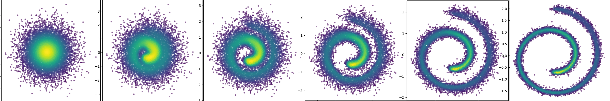

# generax
generax provides implementations of flow based generative models.  The library is built on top of [Equinox](https://github.com/patrick-kidger/equinox) which removes the need to worry about keeping track of model parameters.
```python
key = random.PRNGKey(0) # JAX random key
x = ... # some data

# Create a flow model
model = NeuralSpline(input_shape=x.shape[1:],
                     n_flow_layers=3,
                     n_blocks=4,
                     hidden_size=32,
                     working_size=16,
                     n_spline_knots=8,
                     key=key)

# Data dependent initialization
model = model.data_dependent_init(x, key=key)

# Take multiple samples using vmap
keys = random.split(key, 1000)
samples = eqx.filter_vmap(model.sample)(keys)

# Compute the log probability of data
log_prob = eqx.filter_vmap(model.log_prob)(x)
```

There is also support for probability paths (time-dependent probability distributions) which can be used to train continuous normalizing flows with flow matching.  See the examples on flow matching and multi-sample flow matching for more details.



# Installation
generax is available on pip:
```bash
pip install generax
```

# Training
Generax provides an easy interface to train these models:
```python
trainer = Trainer(checkpoint_path='tmp/model_path')

model = trainer.train(model=model,              # Generax model
                      objective=my_objective,   # Objective function
                      evaluate_model=tester,    # Testing function
                      optimizer=optimizer,      # Optax optimizer
                      num_steps=10000,          # Number of training steps
                      data_iterator=train_ds,   # Training data iterator
                      double_batch=1000,        # Train these many batches in a scan loop
                      checkpoint_every=1000,    # Checkpoint interval
                      test_every=1000,          # Test interval
                      retrain=True)             # Retrain from checkpoint
```
See the examples folder for more details.